# Restobay 


In our day-to-day life, we often go to restaurants. We sometimes find it hard to get a table reserved 
for us and also, we need to wait for a waiter to get the menu card and ask him to note the order. Later, 
he goes and finds out whether all the orders are available or not. This is a time-consuming process.And also, from the owner`s point of view maintaining all the records of the order and computing 
their costs is also a hectic task. A product that drastically improves the communication between the servers and the customers is needed in the current market. To overcome this kind of problem we will 
build a web application in which we can reserve our table, order our food through the available menu items and can also make payments online and also the owner manage the 
status of the order and can view all the records of orders and make computations at the end of the 
day. This brings all necessities in one place that benefits both user and the owner.

 

### Live On

 https://restobay.vercel.app/

#### Demo Video

https://youtu.be/gQN8AUGeppE


 


## Run Locally
 
### Setup frontend 

clone the frontend branch

```bash
  git clone https://github.com/ikarthik21/Restobay.git -b frontend
``` 

Install dependencies

```bash
  npm install
```

Start the server

```bash
  npm run Start
```


### Setup backend 

clone the backend branch

```bash
  git clone https://github.com/ikarthik21/Restobay.git -b backend
``` 

Install dependencies

```bash
  npm install
```

Start the server

```bash
  node server.js
```

## Screenshots

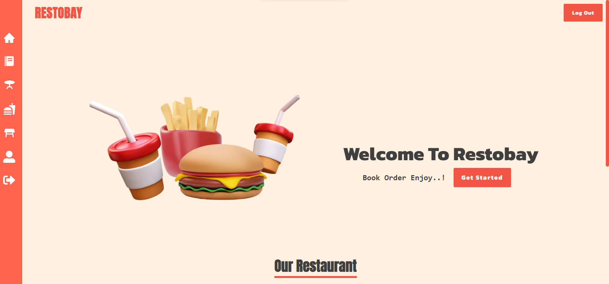
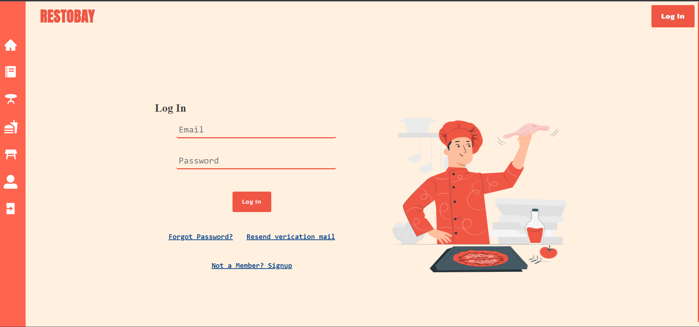
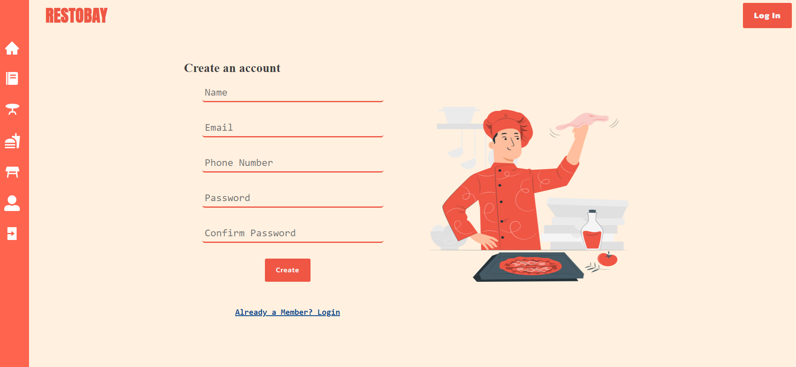
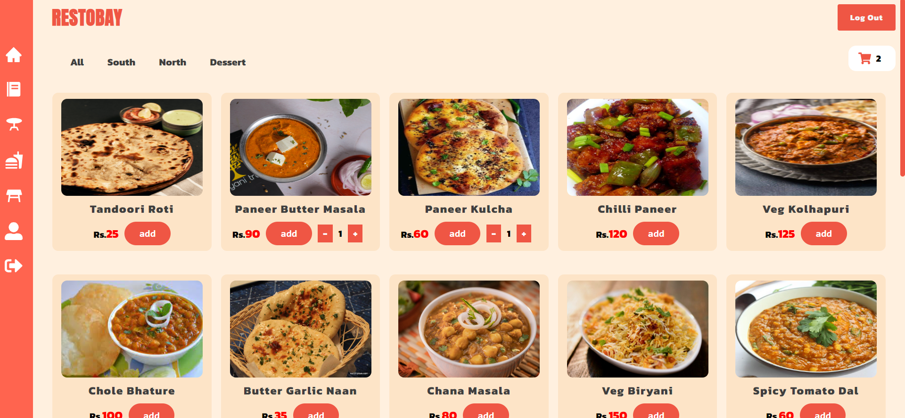
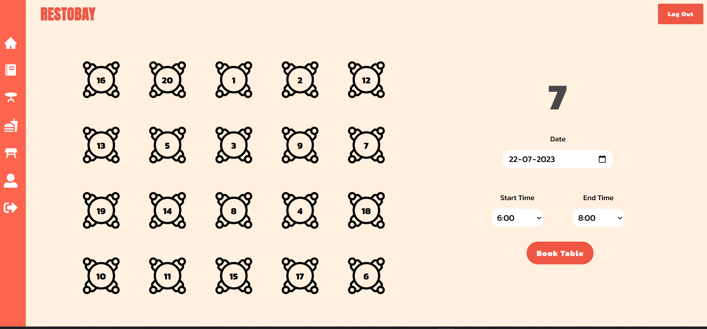
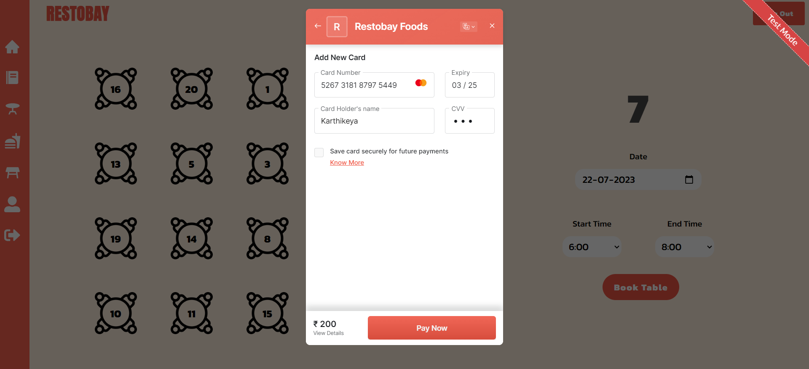
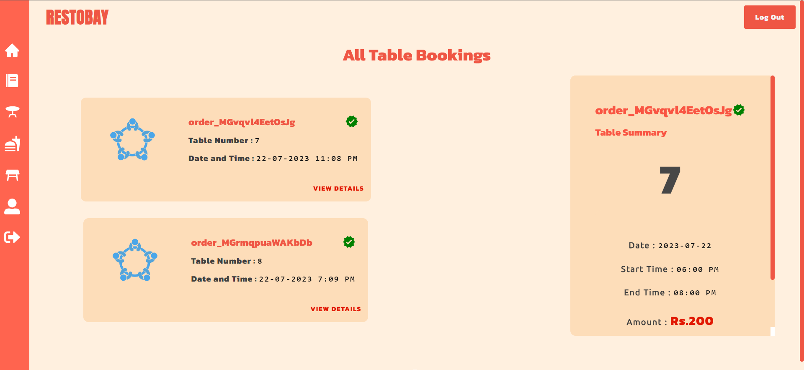
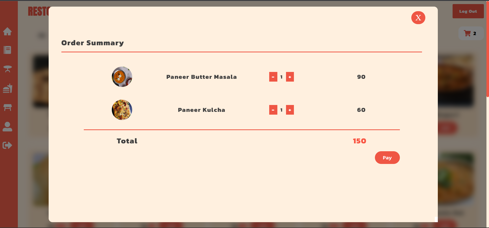
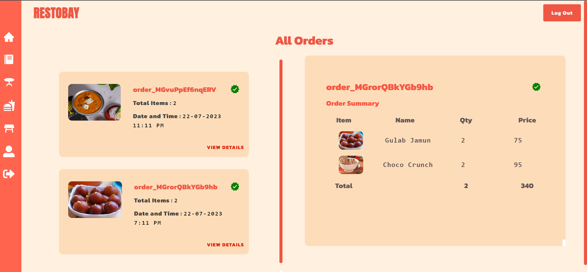
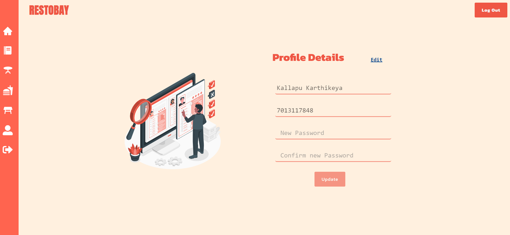
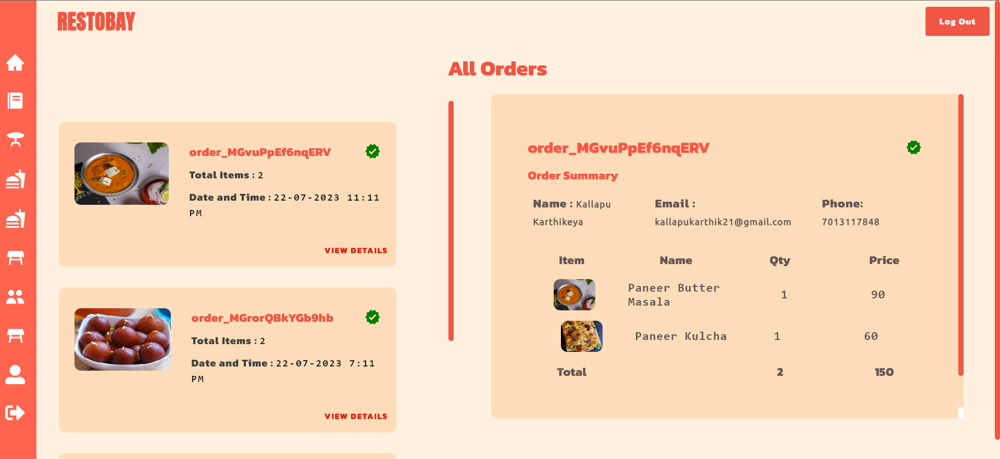
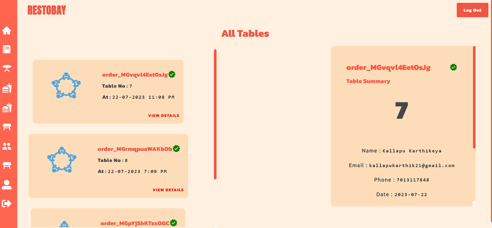


